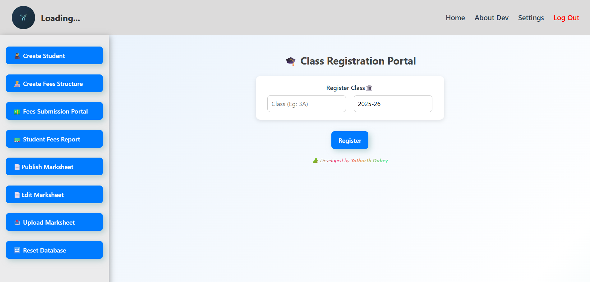
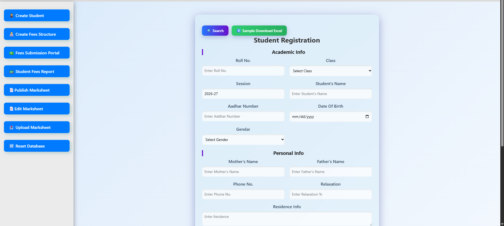
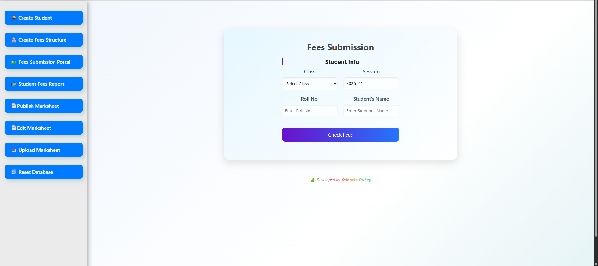
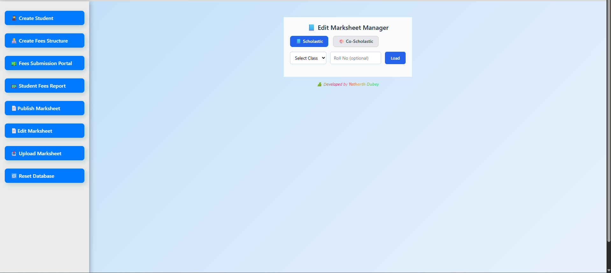
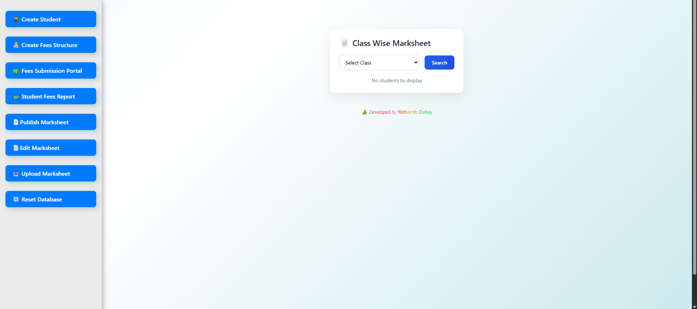

# 🎓 RBS Kids Paradise — Student Management System

A full-stack school management system currently used by a real institution to manage students, fees, and marksheets efficiently.

---

## Check it out -> https://rbs.eduguruji.com/


## 📸 Screenshots

<p align="center">
  
  
  
  
  
</p>
---

## 🧠 Features

- 👨‍🎓 Student Registration System
- 💰 Fees Submission Portal
- 📊 Student Fees Reports
- 📝 Marksheet Upload & Editing
- 📥 Excel Upload Support
- 🏫 Class-wise Data Management
- 🔄 Reset Database Option

---

## 🛠️ Tech Stack

- Frontend: React
- Backend: (add yours)
- Database: (add yours)

---

## ⚙️ Installation

```bash
git clone https://github.com/Yatharth-Dubey/kidspay
npm install
npm start
